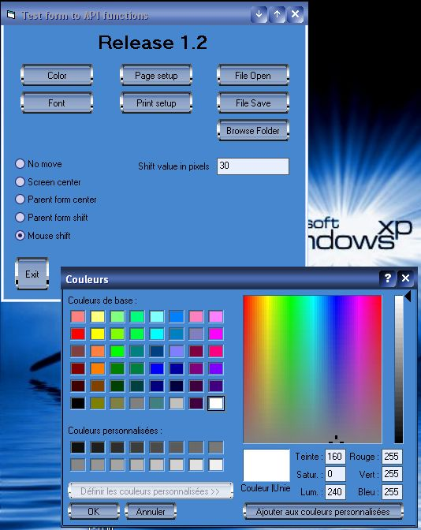



## Windows common dialog boxes with 4 modes positioning and XP design

### Description

This project show how to use (with API calls) all standard common dialog boxes (color, font, page setup, print setup, file open, file save and folder browser). The speciality of this project is that it use one callback routine to move a common dialog around the parent form (screen center, parent form center, parent form shift and mouse shift modes). With this, you can remove the standard Commondialog control from your project and use these easy to use functions.

Last release 1.2 now compute right with all taskbar positions. And last but not the least, this project show how to convert a standard project in XP like style with a call to InitCommonControls API Sub and a manifest file (here Projet1.exe.manifest). See doc on Microsoft sites for this part.

If you like this code, then vote. Thanks.
 
### More Info
 

             |
---                |---
**Submitted On**   |2002-09-25 16:51:02
**By**             |[Jean\-Claude Stritt](https://github.com/Planet-Source-Code/PSCIndex/blob/master/ByAuthor/jean-claude-stritt.md)
**Level**          |Intermediate
**User Rating**    |5.0 (125 globes from 25 users)
**Compatibility**  |VB 6\.0
**Category**       |[VB function enhancement](https://github.com/Planet-Source-Code/PSCIndex/blob/master/ByCategory/vb-function-enhancement__1-25.md)
**World**          |[Visual Basic](https://github.com/Planet-Source-Code/PSCIndex/blob/master/ByWorld/visual-basic.md)
**Archive File**   |[A\_must\_hav1359999252002\.zip](https://github.com/Planet-Source-Code/jean-claude-stritt-windows-common-dialog-boxes-with-4-modes-positioning-and-xp-design__1-39098/archive/master.zip)

